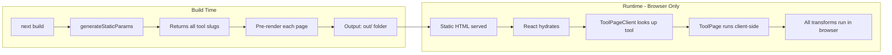

# Full Static Export for Next.js App

This plan converts your app to a fully static site that:

- Pre-renders all pages as HTML at build time
- Runs entirely in the browser (client-side)
- Requires no Node.js server at runtime
- Can be deployed to any static hosting (GitHub Pages, S3, Netlify, Cloudflare Pages, etc.)

## Changes Made

### 1. Enable Static Export in Next.js Config

Updated `next.config.ts`:

```ts
const nextConfig: NextConfig = {
  output: "export",
  reactCompiler: true,
  images: {
    unoptimized: true,
  },
};
```


- `output: "export"` - Generates an `out/` folder with pure static HTML/CSS/JS files
- `images: { unoptimized: true }` - Disables Image Optimization API (requires server, incompatible with static export)

### 2. Add `generateStaticParams` to Dynamic Route

Updated `src/app/tools/[slug]/page.tsx` (server component):

```tsx
import { tools } from "@/lib/tools/registry";
import { ToolPageClient } from "./tool-page-client";

// Only allow pre-rendered paths
export const dynamicParams = false;

// Pre-render all tool pages at build time
export function generateStaticParams() {
  return tools.map((tool) => ({
    slug: tool.slug,
  }));
}

export default async function ToolPageRoute({
  params,
}: {
  params: Promise<{ slug: string }>;
}) {
  const { slug } = await params;

  // Pass only the slug (string) to the client component
  // The client component will look up the tool (which contains functions)
  return <ToolPageClient slug={slug} />;
}
```


### 3. Create Client Wrapper Component

Created `src/app/tools/[slug]/tool-page-client.tsx`:

```tsx
"use client";

import { notFound } from "next/navigation";
import { ToolPage } from "@/components/tools/tool-page";
import { getToolBySlug } from "@/lib/tools/registry";

export function ToolPageClient({ slug }: { slug: string }) {
  const tool = getToolBySlug(slug);

  if (!tool) {
    notFound();
  }

  return <ToolPage tool={tool} />;
}
```

**Why a client wrapper?** The `tool` object contains a `transform` function which cannot be serialized across the server/client boundary. By passing only the `slug` string to the client component, the tool lookup (including functions) happens entirely on the client side.

## How It Works




## Result

After `bun run build`:

```javascript
Route (app)
┌ ○ /
├ ○ /_not-found
└ ● /tools/[slug]
  ├ /tools/url-encode
  ├ /tools/url-parse
  ├ /tools/query-string-json
  └ [+124 more paths]

○  (Static)  prerendered as static content
●  (SSG)     prerendered as static HTML (uses generateStaticParams)
```