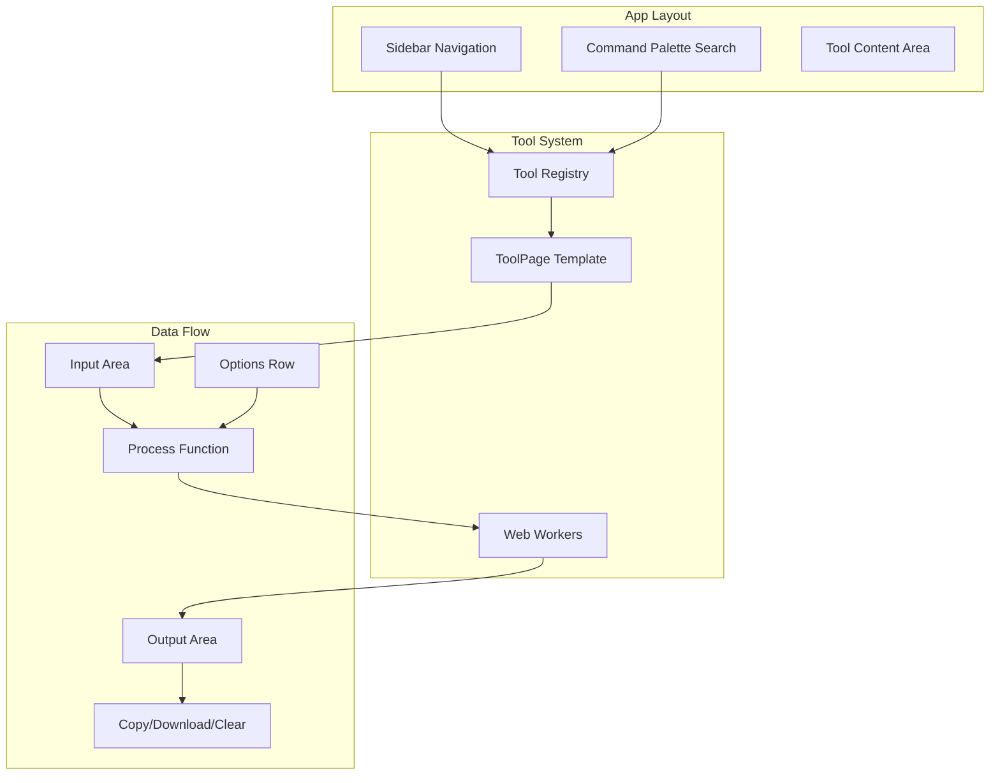

# orle.dev - Developer Tools Platform

## Architecture Overview




## Core Design Principles

1. **One tool = one config object** - Each tool is defined by a single TypeScript object with metadata, options, and a transform function
2. **Shared ToolPage template** - All tools render through one component, eliminating repetitive UI code
3. **Registry-driven navigation** - Tools auto-populate sidebar and search from a central registry
4. **Web Workers for heavy ops** - Hashing, image processing, and diff run off the main thread

---

## File Structure

```javascript
src/
  app/
    layout.tsx              # Root layout with ThemeProvider
    page.tsx                # Home/dashboard
    tools/
      [slug]/
        page.tsx            # Dynamic tool page (renders ToolPage)
  components/
    layout/
      app-sidebar.tsx       # Left sidebar with sections
      command-search.tsx    # Fuzzy search (Cmd+K)
      theme-toggle.tsx      # Dark/light toggle
    tools/
      tool-page.tsx         # THE unified tool template
      tool-input.tsx        # Textarea + file drop zone
      tool-output.tsx       # Output with copy/download
      tool-options.tsx      # Dynamic options renderer
      tool-examples.tsx     # Accordion with examples
    ui/                     # (existing shadcn components)
  lib/
    tools/
      registry.ts           # Central tool registry + sections
      types.ts              # ToolDefinition, ToolSection types
      use-tool.ts           # Hook for tool state + localStorage
      sections/
        encoding.ts         # URL, Base64, Hex tools
        json.ts             # JSON, YAML, XML tools
        text.ts             # Text transformation tools
        diff.ts             # Diff and compare tools
        crypto.ts           # Hashing, HMAC, JWT tools
        ids.ts              # UUID, ULID, NanoID tools
        datetime.ts         # Epoch, timezone tools
        numbers.ts          # Base converter, bitwise tools
        http.ts             # HTTP helpers, cURL tools
        images.ts           # Compress, resize, convert tools
        colors.ts           # HEX, RGB, contrast tools
        code.ts             # Beautify, escape tools
    workers/
      index.ts              # Worker dispatcher
      hash.worker.ts        # SHA, MD5, file hashing
      diff.worker.ts        # Text/JSON diff
      image.worker.ts       # Image processing
    utils.ts                # Shared utilities
  hooks/
    use-file-drop.ts        # Drag & drop hook
    use-clipboard.ts        # Copy to clipboard
    use-local-storage.ts    # Persist tool inputs
```

---

## Implementation Phases

### Phase 1: Core Infrastructure

**1.1 Tool Type System** ([src/lib/tools/types.ts](src/lib/tools/types.ts))

```typescript
type ToolDefinition = {
  slug: string;
  name: string;
  description: string;
  section: string;
  aliases: string[];           // For fuzzy search
  inputType: 'text' | 'file' | 'dual';
  outputType: 'text' | 'image' | 'download';
  options?: ToolOption[];      // Dynamic options
  transform: (input: string, options: Record<string, unknown>) => string | Promise<string>;
  examples?: { input: string; output: string }[];
};
```

**1.2 Unified ToolPage Component** ([src/components/tools/tool-page.tsx](src/components/tools/tool-page.tsx))Single component that renders ANY tool:

- Fetches tool definition from registry by slug
- Renders input area (text/file based on `inputType`)
- Renders dynamic options from `options` array
- Calls `transform()` on input change (debounced)
- Displays output with copy/download buttons
- Persists last input to localStorage (toggle in settings)

**1.3 Tool Registry** ([src/lib/tools/registry.ts](src/lib/tools/registry.ts))

```typescript
const SECTIONS: ToolSection[] = [
  { id: 'encoding', name: 'URL & Encoding', icon: Link2 },
  { id: 'base64', name: 'Base64 & Bytes', icon: Binary },
  // ... 13 sections total
];

const tools: ToolDefinition[] = [...encodingTools, ...base64Tools, ...];

export const getToolBySlug = (slug: string) => tools.find(t => t.slug === slug);
export const searchTools = (query: string) => /* fuzzy match on name + aliases */;
```

**1.4 Web Worker Infrastructure** ([src/lib/workers/](src/lib/workers/))Worker dispatcher pattern:

```typescript
// tools can specify: useWorker: 'hash' | 'diff' | 'image'
const result = await runInWorker('hash', { algorithm: 'sha256', data });
```

---

### Phase 2: Layout and Navigation

**2.1 App Layout** ([src/app/layout.tsx](src/app/layout.tsx))

- ThemeProvider (next-themes) wrapping body
- SidebarProvider from shadcn

**2.2 App Sidebar** ([src/components/layout/app-sidebar.tsx](src/components/layout/app-sidebar.tsx))

- Collapsible sections from SECTIONS constant
- Tools grouped by section, rendered from registry
- Active state based on current route

**2.3 Command Search** ([src/components/layout/command-search.tsx](src/components/layout/command-search.tsx))

- Cmd+K to open
- Uses cmdk (already installed)
- Fuzzy search across tool names + aliases
- Navigate to tool on selection

---

### Phase 3: Implement All Tool Sections

Each section file exports an array of ToolDefinition objects. The transform functions are pure and testable.| Section | File | Tools Count ||---------|------|-------------|| URL & Encoding | `sections/encoding.ts` | 10 || Base64 & Bytes | `sections/base64.ts` | 10 || Text Transforms | `sections/text.ts` | 15 || JSON/YAML/XML | `sections/formats.ts` | 15 || Diff & Compare | `sections/diff.ts` | 8 || Crypto & Hashing | `sections/crypto.ts` | 12 || IDs & Tokens | `sections/ids.ts` | 6 || Date & Time | `sections/datetime.ts` | 7 || Numbers & Bits | `sections/numbers.ts` | 9 || HTTP Helpers | `sections/http.ts` | 9 || Images & Media | `sections/images.ts` | 12 || Colors & CSS | `sections/colors.ts` | 10 || Code Cleanup | `sections/code.ts` | 5 |**Total: ~118 tools**---

### Phase 4: Polish and Features

- **Theme toggle** with system preference detection
- **"Processed locally"** badge in footer
- **Keyboard shortcuts** (Cmd+Enter to transform, Cmd+Shift+C to copy output)
- **Shareable links** for small inputs (encode to URL hash, max 2KB)
- **Settings panel** (persist inputs toggle, clear all data)

---

## Key Dependencies to Add

```bash
bun add fuse.js       # Fuzzy search
bun add js-yaml       # YAML parsing
bun add diff          # Text diff
bun add uuid          # UUID generation
bun add nanoid        # NanoID generation
bun add qrcode        # QR code generation
```

---

## Why This Architecture Minimizes LOC

1. **No per-tool page files** - Dynamic `[slug]/page.tsx` handles all 100+ tools
2. **No per-tool components** - ToolPage template renders everything
3. **Pure transform functions** - Each tool is ~10-50 lines of logic
4. **Shared options renderer** - Toggles, selects, inputs generated from config
5. **Registry-driven UI** - Sidebar and search auto-update when tools are added

Estimated total: **~4,000 lines** for full implementation (vs ~15,000+ with per-tool components).---

## Next Steps

1. Set up tool types and registry infrastructure
2. Build the ToolPage template component
3. Implement layout with sidebar and search