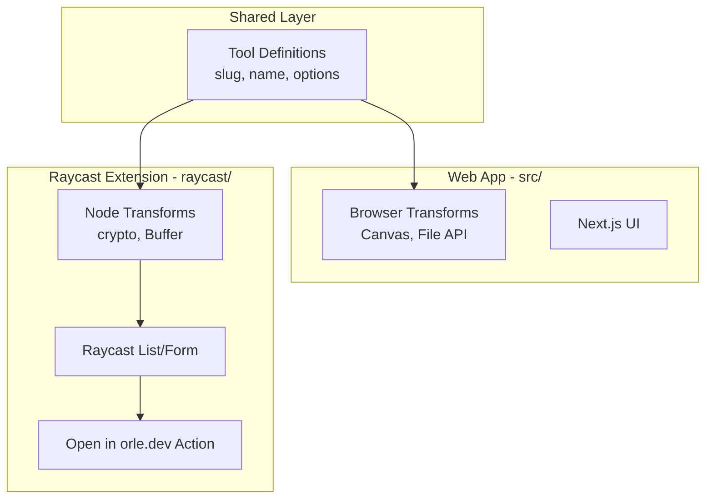

# Raycast Extension for orle.dev Developer Tools

## Architecture

The Raycast extension will be a separate package inside `/raycast` that shares tool definitions with the web app by importing from a common source. Since Raycast uses Node.js (not browser), we'll need to create Node-compatible versions of transform functions.




## Tool Compatibility

Tools will be categorized by their Raycast compatibility:| Type | Compatible | Examples ||------|------------|----------|| Text-in/Text-out | Yes | URL encode, JSON format, case convert || Generators (none input) | Yes | UUID, NanoID, passwords || Dual input (diff) | Partial | Text diff via Form with 2 textareas || File input | No | Image compress, file hash || Browser-only | No | Canvas-based image tools |Approximately 80+ tools will be compatible.

## Extension Structure

```javascript
raycast/
  package.json              # Raycast extension manifest
  tsconfig.json
  src/
    index.tsx               # Main searchable list command
    search-tools.tsx        # Alias command for searching
    utils/
      registry.ts           # Node-compatible tool registry
      transforms.ts         # Node-compatible transform functions
    components/
      tool-form.tsx         # Generic form for tool with options
      tool-actions.tsx      # Copy, Open in Web, Paste actions
```


## Key Features

### 1. Single Searchable Command

- Lists all compatible tools grouped by section
- Fuzzy search by name, aliases, description
- Shows tool description as subtitle
- Keyboard shortcut: configurable

### 2. Tool Execution Flow

1. User selects tool from list
2. If generator (no input): immediately run and show result
3. If text input: push Form view with textarea + options
4. Execute transform, show result in Detail view
5. Actions: Copy, Paste to frontmost app, Open in orle.dev

### 3. "Open in orle.dev" Action

- Constructs URL: `https://orle.dev/tools/{slug}?input={base64}&options={json}`
- Web app will read URL params and pre-fill
- Enables seamless handoff for complex tools

### 4. Quick Actions

- Transform from Clipboard: read clipboard, apply tool, copy result
- Each tool gets a "Transform Clipboard" action

## Implementation Details

### Shared Tool Metadata

Create a shared JSON-exportable format in [`src/lib/tools/tool-metadata.ts`](src/lib/tools/tool-metadata.ts):

```typescript
export type ToolMeta = {
  slug: string;
  name: string;
  description: string;
  section: string;
  aliases: string[];
  inputType: 'text' | 'none' | 'dual' | 'file';
  options?: ToolOption[];
  raycastCompatible: boolean;
};
```


### Node-Compatible Transforms

Re-implement transforms using Node.js APIs in `raycast/src/utils/transforms.ts`:

- Use `crypto` module for hashing (SHA, MD5)
- Use `Buffer` for Base64
- Use built-in `encodeURIComponent`/`decodeURIComponent` for URL encoding
- Use `uuid` and `nanoid` packages (already in project)

### Web App URL Handler

Update [`src/app/tools/[slug]/page.tsx`](src/app/tools/[slug]/page.tsx) to:

- Read `?input=` and `?options=` query params
- Base64 decode input and JSON parse options
- Pre-fill the tool with provided data

## Files to Create/Modify

### New Files (raycast/)

1. `raycast/package.json` - Extension manifest with single command
2. `raycast/tsconfig.json` - TypeScript config
3. `raycast/src/index.tsx` - Main searchable list
4. `raycast/src/utils/registry.ts` - Tool registry for Raycast
5. `raycast/src/utils/transforms.ts` - Node-compatible transforms
6. `raycast/src/components/tool-form.tsx` - Generic tool form
7. `raycast/src/components/tool-result.tsx` - Result view with actions
8. `raycast/assets/extension-icon.png` - Extension icon

### Modified Files (src/)

1. [`src/lib/tools/tool-metadata.ts`](src/lib/tools/tool-metadata.ts) - Shared metadata export (new)
2. [`src/app/tools/[slug]/page.tsx`](src/app/tools/[slug]/page.tsx) - Add URL param reading

## Raycast Manifest (package.json)

```json
{
  "name": "orle",
  "title": "orle.dev Developer Tools",
  "description": "100+ developer tools: URL encode, JSON format, UUID, hashing, and more",
  "icon": "extension-icon.png",
  "commands": [
    {
      "name": "search-tools",
      "title": "Search Developer Tools",
      "subtitle": "orle.dev",
      "description": "Search and use 100+ developer tools",
      "mode": "view"
    }
  ],
  "dependencies": {
    "@raycast/api": "^1.93.3",
    "uuid": "^11.1.0",
    "nanoid": "^5.1.5"
  }
}


```